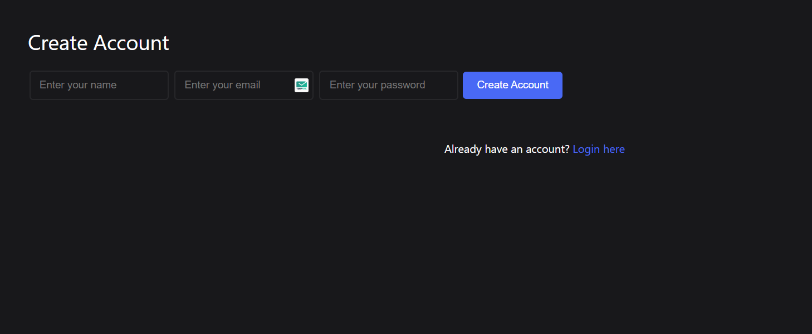
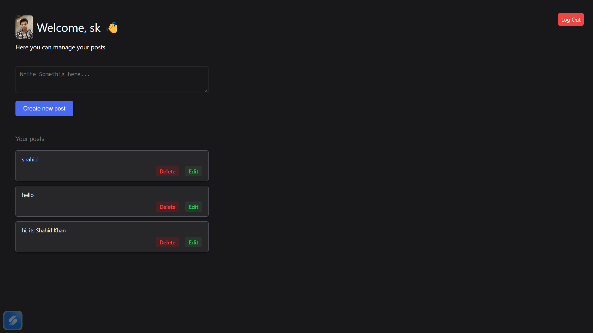

# Simple Blog/Post App with User Authentication

A full-stack web application built with **Node.js**, **Express**, and **MongoDB**.  
This project allows users to register, log in, manage their personal posts, and upload a profile picture. It serves as a practical example of building a secure, database-driven application with server-side rendering using **EJS**.

---

## Demo

Here's a look at the application in action. This showcases the user profile page, post creation, and the profile picture functionality.

Here's a look at the application in action.  

### Login / Register Page


### Profile Page


---

## Features

- **User Authentication:** Secure user registration and login system.  
- **Password Hashing:** Passwords are encrypted using **bcrypt** for enhanced security.  
- **JWT Authentication:** User sessions are managed with **JSON Web Tokens** stored in secure cookies.  
- **Full CRUD for Posts:** Users can Create, Read, Update, and Delete their own posts.  
- **Profile Picture Uploads:** Users can upload and update their profile picture using **multer**.  
- **Server-Side Rendering:** Dynamic web pages are rendered using **EJS templates**.  
- **Responsive Design:** A clean, mobile-friendly user interface.  

---

## Tech Stack

<p align="left">
  
  
  
  
  
  
</p>

---

## Prerequisites

Before you begin, ensure you have the following installed on your local machine:

- **Node.js** (which includes npm)  
- **MongoDB**  

---

## Getting Started

Follow these steps to get the project up and running on your local machine.

### 1. Clone the Repository
```bash
git clone https://github.com/shahidx05/Auth-Posts
cd your-repository-name
```
### 2. Install Dependencies
```bash
npm install
```
### 3. Set Up Environment Variables
Create a .env file in the root of your project and add the following variables:
```bash
# Your MongoDB connection string
MONGO_URI=mongodb://localhost:27017/your_db_name

# A long, random, and secure string for JWT
JWT_SECRET=your-super-secret-and-long-random-string

# The port your server will run on (optional, defaults to 5000)
PORT=5000

```
### 4. Create the 'uploads' Directory
In the root of the project, create a folder named uploads. This is where profile pictures will be stored.
```bash
mkdir uploads
```
### 5. Run the Application
Start the server using the following command:
```bash
npm start
```
Your application should now be running at http://localhost:5000


If you want, I can also make a **more visually appealing version** with badges for **Node.js**, **MongoDB**, **JWT**, and **EJS**, which makes it look more professional for GitHub.  

Do you want me to do that?
